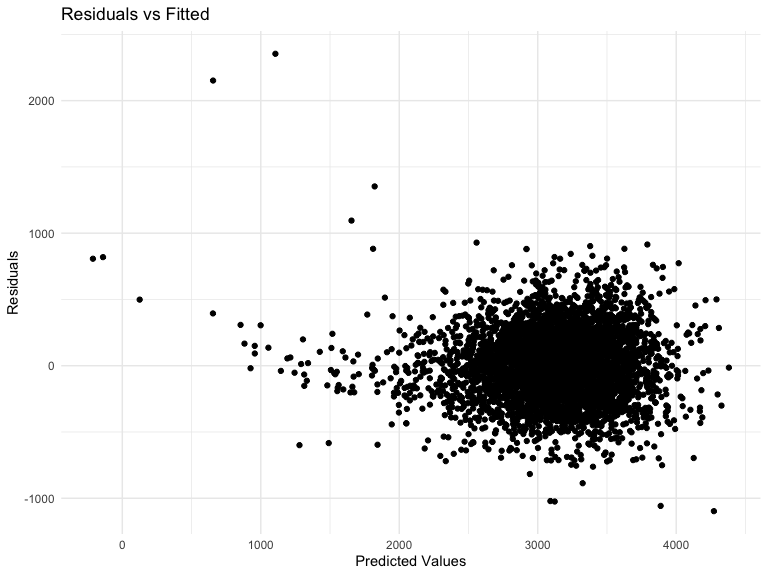
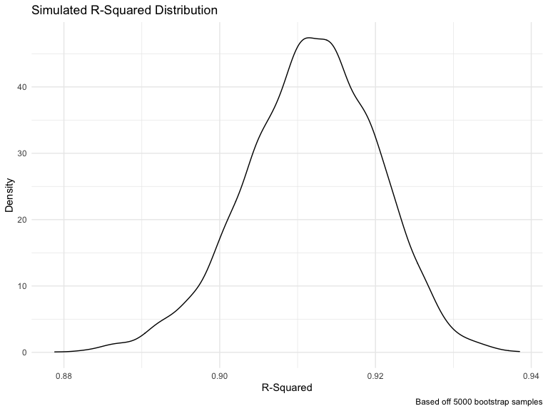
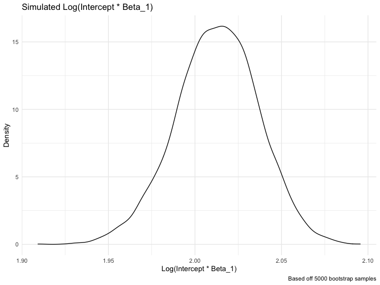

Homework 6
================
Cynthia Liu (cl3938)

### Problem 1

``` r
homicide_df = 
  read_csv("data/homicide-data.csv", na = c("", "NA", "Unknown")) %>% 
  mutate(
    city_state = str_c(city, state, sep = ", "),
    victim_age = as.numeric(victim_age),
    resolution = case_when(
      disposition == "Closed without arrest" ~ 0,
      disposition == "Open/No arrest"        ~ 0,
      disposition == "Closed by arrest"      ~ 1)
  ) %>% 
  filter(
    victim_race %in% c("White", "Black"),
    city_state != "Tulsa, AL") %>% 
  dplyr::select(city_state, resolution, victim_age, victim_race, victim_sex)
```

    ## Parsed with column specification:
    ## cols(
    ##   uid = col_character(),
    ##   reported_date = col_double(),
    ##   victim_last = col_character(),
    ##   victim_first = col_character(),
    ##   victim_race = col_character(),
    ##   victim_age = col_double(),
    ##   victim_sex = col_character(),
    ##   city = col_character(),
    ##   state = col_character(),
    ##   lat = col_double(),
    ##   lon = col_double(),
    ##   disposition = col_character()
    ## )

Start with one city.

``` r
baltimore_df =
  homicide_df %>% 
  filter(city_state == "Baltimore, MD")
glm(resolution ~ victim_age + victim_race + victim_sex, 
    data = baltimore_df,
    family = binomial()) %>% 
  broom::tidy() %>% 
  mutate(
    OR = exp(estimate),
    CI_lower = exp(estimate - 1.96 * std.error),
    CI_upper = exp(estimate + 1.96 * std.error)
  ) %>% 
  dplyr::select(term, OR, starts_with("CI")) %>% 
  knitr::kable(digits = 3)
```

| term              |    OR | CI\_lower | CI\_upper |
| :---------------- | ----: | --------: | --------: |
| (Intercept)       | 1.363 |     0.975 |     1.907 |
| victim\_age       | 0.993 |     0.987 |     1.000 |
| victim\_raceWhite | 2.320 |     1.648 |     3.268 |
| victim\_sexMale   | 0.426 |     0.325 |     0.558 |

Try this across cities.

``` r
models_results_df = 
  homicide_df %>% 
  nest(data = -city_state) %>% 
  mutate(
    models = 
      map(.x = data, ~glm(resolution ~ victim_age + victim_race + victim_sex, data = .x, family = binomial())),
    results = map(models, broom::tidy)
  ) %>% 
  dplyr::select(city_state, results) %>% 
  unnest(results) %>% 
  mutate(
    OR = exp(estimate),
    CI_lower = exp(estimate - 1.96 * std.error),
    CI_upper = exp(estimate + 1.96 * std.error)
  ) %>% 
  dplyr::select(city_state, term, OR, starts_with("CI")) 
```

``` r
models_results_df %>% 
  filter(term == "victim_sexMale") %>% 
  mutate(city_state = fct_reorder(city_state, OR)) %>% 
  ggplot(aes(x = city_state, y = OR)) + 
  geom_point() + 
  geom_errorbar(aes(ymin = CI_lower, ymax = CI_upper)) + 
  theme(axis.text.x = element_text(angle = 90, hjust = 1))
```


### Problem 2

First, let’s import and clean the data. The following steps were taken:

  - Import CSV
  - Clean names
  - Change relevant variables to factor

<!-- end list -->

``` r
#input data
baby_df = 
  read_csv("./data/birthweight.csv") %>%
  janitor::clean_names() %>%
  mutate(
    babysex = as.factor(babysex),
    frace = as.factor(frace),
    malform = as.factor(malform),
    mrace = as.factor(mrace)) 
```

    ## Parsed with column specification:
    ## cols(
    ##   .default = col_double()
    ## )

    ## See spec(...) for full column specifications.

There are 0 missing values in the entire dataframe. This is great, so
we’ll progress to making our regression models.

Model 1: curated model

For this model, we’ll use a stepwise algorithm to automatically select
the best model from the full list of predictors. This is primarily used
as exploratory analysis: the model adds and removes predictors
iteratively based on a predetermined criteria. For my purposes, I’m
going to use Akaike Information Criteria, or AIC, a metric that is a
good balance between prioritizing model fit and also penalizing for too
many predictors.

It’s important to note that stepwise model selection results shouldn’t
be overintepreted, and there’s a great deal of uncertainty surrounding
them. I’m only going to use it to explore the data a bit, since I know
next to nothing about this field - true models should always be based in
reason & literature review.

Let’s get started\! For my stepwise model selection process, I’ll be
using all the predictor main effects. Because of computational
limitations, we’ll restrict our analyses to main effects without
interaction terms.

``` r
#Fit the full model 
full_bwt_linear.model <- lm(bwt~., data = baby_df)

#Stepwise regression model
step_bwt_linear.model <- stepAIC(full_bwt_linear.model, direction = "both", 
                      trace = FALSE)
```

Let’s take a look at the selected predictors and parameter estimates\!
We’ll also plot the residuals against the fitted values to check for
normality.

``` r
#Display converged model
step_bwt_linear.model %>% 
  broom::tidy() %>%
  knitr::kable(digits = 3)
```

| term        |   estimate | std.error | statistic | p.value |
| :---------- | ---------: | --------: | --------: | ------: |
| (Intercept) | \-6098.822 |   137.546 |  \-44.340 |   0.000 |
| babysex2    |     28.558 |     8.455 |     3.378 |   0.001 |
| bhead       |    130.777 |     3.447 |    37.944 |   0.000 |
| blength     |     74.947 |     2.019 |    37.120 |   0.000 |
| delwt       |      4.107 |     0.392 |    10.475 |   0.000 |
| fincome     |      0.318 |     0.175 |     1.820 |   0.069 |
| gaweeks     |     11.592 |     1.462 |     7.929 |   0.000 |
| mheight     |      6.594 |     1.785 |     3.694 |   0.000 |
| mrace2      |  \-138.792 |     9.907 |  \-14.009 |   0.000 |
| mrace3      |   \-74.887 |    42.315 |   \-1.770 |   0.077 |
| mrace4      |  \-100.678 |    19.325 |   \-5.210 |   0.000 |
| parity      |     96.305 |    40.336 |     2.388 |   0.017 |
| ppwt        |    \-2.676 |     0.427 |   \-6.261 |   0.000 |
| smoken      |    \-4.843 |     0.586 |   \-8.271 |   0.000 |

``` r
#Plot the model
baby_df %>% 
  modelr::add_residuals(step_bwt_linear.model) %>% 
  modelr::add_predictions(step_bwt_linear.model) %>%
  ggplot(aes(x = pred, y = resid)) + 
  geom_point() +
  labs(
    x = "Predicted Values",
    y = "Residuals",
    title = "Residuals vs Fitted"
  )
```


The predictors chosen were babysex (male vs female), bhead, blength,
delwt, fincome, gaweeks, mheight, mrace (only if Black, Asian, and
Puerto Rican mothers), parity, ppwt, and smoken. So the model’s not
perfect, but it appears that the residuals are largely scattered around
the Y = 0 line in a symmetrical manner, meaning our model residuals are
likely normally distributed enough that the linear regression we fit is
appropriate. Let’s try some other models\!

Other models:

  - Model 1: length at birth and gestational age as predictors (main
    effects only)

<!-- end list -->

``` r
test_1.model <- lm(bwt~gaweeks + blength, data= baby_df)

test_1.model %>% 
  broom::tidy() %>%
  knitr::kable(digits = 3)
```

| term        |   estimate | std.error | statistic | p.value |
| :---------- | ---------: | --------: | --------: | ------: |
| (Intercept) | \-4347.667 |    97.958 |  \-44.383 |       0 |
| gaweeks     |     27.047 |     1.718 |    15.744 |       0 |
| blength     |    128.556 |     1.990 |    64.604 |       0 |

  - Model 2: head circumference, length, sex, and all interactions
    (including the three-way interaction) between these

<!-- end list -->

``` r
test_2.model <- lm(bwt~babysex*bhead*blength, data = baby_df)

test_2.model %>% 
  broom::tidy() %>%
  knitr::kable(digits = 3)
```

| term                   |   estimate | std.error | statistic | p.value |
| :--------------------- | ---------: | --------: | --------: | ------: |
| (Intercept)            | \-7176.817 |  1264.840 |   \-5.674 |   0.000 |
| babysex2               |   6374.868 |  1677.767 |     3.800 |   0.000 |
| bhead                  |    181.796 |    38.054 |     4.777 |   0.000 |
| blength                |    102.127 |    26.212 |     3.896 |   0.000 |
| babysex2:bhead         |  \-198.393 |    51.092 |   \-3.883 |   0.000 |
| babysex2:blength       |  \-123.773 |    35.119 |   \-3.524 |   0.000 |
| bhead:blength          |    \-0.554 |     0.780 |   \-0.710 |   0.478 |
| babysex2:bhead:blength |      3.878 |     1.057 |     3.670 |   0.000 |

Let’s start with cross-validation\! Splitting data into training &
testing:

``` r
cv_df =
  crossv_mc(baby_df, 100) %>% 
  mutate(
    train = map(train, as_tibble),
    test = map(test, as_tibble))
```

Fitting models & obtaining RMSE values:

``` r
cv_df = 
  cv_df %>% 
  mutate(
    step_mod  = map(train, ~lm(bwt~babysex + bhead + blength + delwt + fincome + gaweeks + mrace + parity + ppwt + smoken, data = .x)),
    test1_mod = map(train, ~lm(bwt~gaweeks + blength, data = .x)),
    test2_mod = map(train, ~lm(bwt~babysex*bhead*blength, data = .x))) %>% 
  mutate(
    rmse_step = map2_dbl(step_mod, test, ~rmse(model = .x, data = .y)),
    rmse_test1  = map2_dbl(test1_mod, test, ~rmse(model = .x, data = .y)),
    rmse_test2 = map2_dbl(test2_mod, test, ~rmse(model = .x, data = .y)))
```

Okay, now let’s make our violin plots:

``` r
cv_df %>% 
  dplyr::select(starts_with("rmse")) %>% 
  pivot_longer(
    everything(),
    names_to = "model", 
    values_to = "rmse",
    names_prefix = "rmse_") %>% 
  mutate(model = fct_inorder(model)) %>% 
  ggplot(aes(x = model, y = rmse)) + geom_violin()
```


Since we want lower RMSE, it appears the model built using a stepwise
selection process with AIC is the best model. However, it’s important to
note that it isn’t that different from the second test model in terms of
RMSE. There’s always a tradeoff to consider in terms of model parsimony
and fit, but that conversation is outside of what we’re trying to do
here. It appears the stepwise model selection process did a good job
selecting relevant predictors\! Now before we report results, we should
compare results to literature and check for multicollinearity…

### Problem 3

Import data

``` r
weather_df = 
  rnoaa::meteo_pull_monitors(
    c("USW00094728"),
    var = c("PRCP", "TMIN", "TMAX"), 
    date_min = "2017-01-01",
    date_max = "2017-12-31") %>%
  mutate(
    name = recode(id, USW00094728 = "CentralPark_NY"),
    tmin = tmin / 10,
    tmax = tmax / 10) %>%
  dplyr::select(name, id, everything())
```

    ## using cached file: /Users/cynthialiu/Library/Caches/R/noaa_ghcnd/USW00094728.dly

    ## date created (size, mb): 2020-12-09 02:11:43 (7.536)

    ## file min/max dates: 1869-01-01 / 2020-12-31

Now let’s run 5000 bootstrap samples, regressing tmax as a function of
tmin. From there, we’ll obtain the esimated R-squared values and
log(beta\_0\*beta\_1) value as well as the 95% confidence intervals for
them both.

``` r
weather_bootstrap_df = weather_df %>% 
  modelr::bootstrap(n = 5000) %>% 
  mutate(
    models = map(strap, ~lm(tmax ~ tmin, data = .x) ),
    r2_results = map(models, broom::glance),
    beta_results = map(models, broom::tidy)) %>%
  dplyr::select(-strap, -models) %>%
  unnest(beta_results, r2_results) %>%
  dplyr::select(.id, r.squared, term, estimate) %>%
  pivot_wider(
    names_from = "term",
    values_from = "estimate") %>%
  janitor::clean_names() %>%
  mutate(
    log_betas = log(intercept*tmin)
  )
```

Adding confidence interval

``` r
bootstrap_ci = weather_bootstrap_df %>%
  summarize (
    r_squared_lower_ci = quantile(r_squared, 0.025),
    r_squared_upper_ci = quantile(r_squared, 0.975),
    log_beta_lower_ci = quantile(log_betas, 0.025),
    log_beta_upper_ci = quantile(log_betas, 0.975)
  )
```

Let’s go ahead and plot the data we generated from the bootstrap
samples.

Starting with the estimated R-squared distribution:

``` r
weather_bootstrap_df %>%
  ggplot(aes(x = r_squared)) + 
  geom_density() +
  labs(
    x = "R-Squared",
    y = "Density",
    title = "Simulated R-Squared Distribution",
    caption = "Based off 5000 bootstrap samples"
  )
```



The 95% confidence interval for the R-squared is (0.8935216, 0.9274739)

Next, the log(beta\_0\*beta\_1) distribution:

``` r
weather_bootstrap_df %>%
  ggplot(aes(x = log_betas)) + 
  geom_density() +
    labs(
    x = "Log(Intercept * Beta_1)",
    y = "Density",
    title = "Simulated Log(Intercept * Beta_1)",
    caption = "Based off 5000 bootstrap samples"
  )
```



The 95% confidence interval for the log(beta\_0\*beta\_1) is (1.9661934,
2.0583239).

Unsurprisingly, both of our distributions look like they follow our
favorite normal distribution\!
